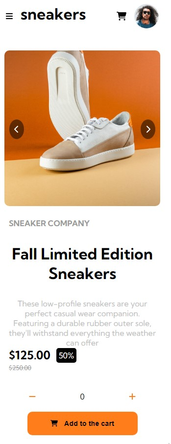

# E-COMMERCE PAGE

Layout of a product preview page proposed by the front end mentor. 

challenge link: https://www.frontendmentor.io/challenges/ecommerce-product-page-UPsZ9MJp6/hub





## Installation


1. **Clone the repository:**
    ```bash
    git clone https://github.com/Erne1984/E-commerce-page.git
    cd E-commerce-page
    ```

2. **Install dependencies:**
    ```bash
    npm install
    ```

3. **Start the development server:**
    ```bash
    npm run dev
    ```

The application should now be running on `http://localhost:5173`.


## Dependencies

- **React**: A JavaScript library for building user interfaces.
- **FontAwesome**: An icon library for adding scalable vector icons.
- **TypeScript**: A strongly typed programming language that builds on JavaScript, giving you better tooling at any scale.